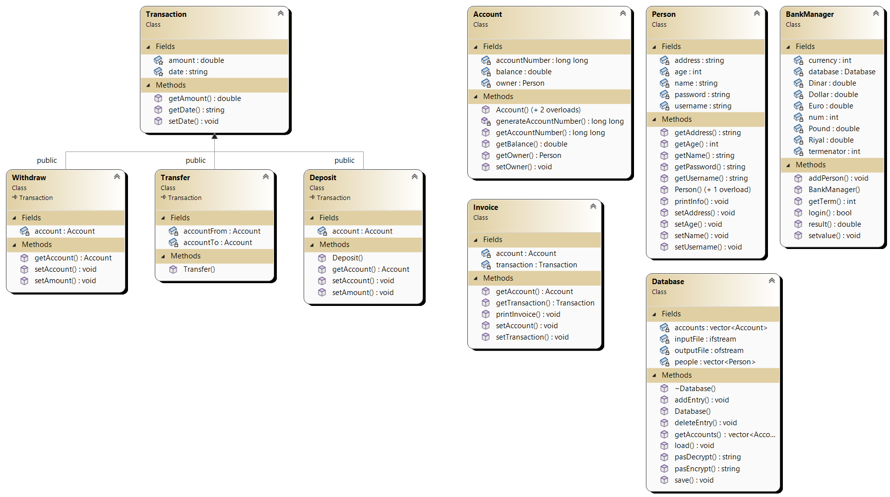

# Bank Management System

A bank management system that includes a login screen for accessing accounts and ability to withdraw, deposit, and transfer to other people. The system also stores all information in a Database and the passwords are encrypted as well for additional security. 

## Features

The system is written in C++ and applies the OOP paradigm in the code using concepts like Encapsulation, Inheritance, and Polymorphism. The program also uses pointers for some parts to utilize the heap memory and offload heavy objects to there.

Some of the features the system provides are: 

- Text User Interface for interacting with the system (TUI)
- User creation (as many as you want).
- Multi-account creation (as many as you want).
- Deposit, transfer, and withdraw transactions.
- Database system for saving all records offline.
- Password encryption.


## Screenshots

Unified Modeling Language (UML) diagram for the project.



Sequence Diagram for the `createUser()` function in the `main.cpp` file.


## Installation

Install [bank-management-system](https://github.com/kareem-ghazi/bank-management-system) with bash

```bash
  git clone https://github.com/kareem-ghazi/smart-surveillance-system.git
```
    
## Authors

- [@kareem-ghazi](https://www.github.com/kareem-ghazi)
- [@Ser5io](https://github.com/Ser5io)
- [@Dark72234](https://github.com/Dark72234)

## License

[MIT](https://choosealicense.com/licenses/mit/)

