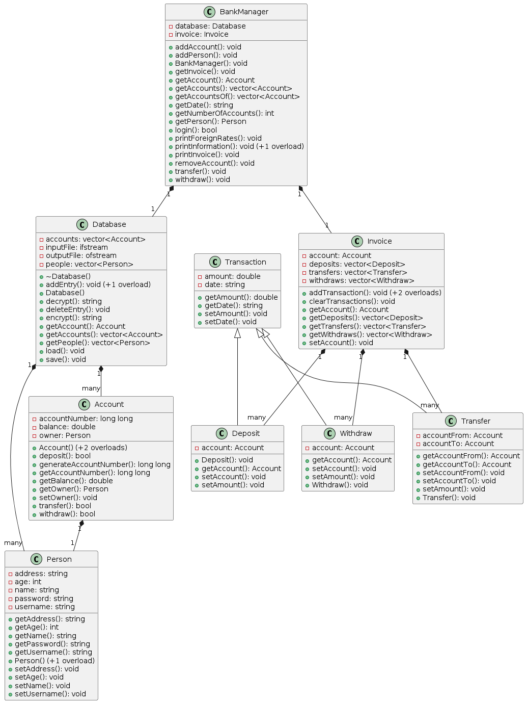

#  Bank Management System

A bank management system that includes a login screen for accessing accounts and ability to withdraw, deposit, and transfer to other people. The system also stores all information in a Database and the passwords are encrypted as well for additional security. 

## Features

The system is written in C++ and applies the OOP paradigm in the code using concepts like Encapsulation, Inheritance, and Polymorphism. The program also uses pointers for some parts in the program to allow for the editing of bank accounts.

Some of the features the system provides are: 

- Text User Interface for interacting with the system (TUI)
- User creation (up to 25,000 comfortably).
- Multi-account creation (up to 25,000 comfortably).
- Deposit, transfer, and withdraw transactions.
- Invoice listing all transactions in an account session.
- Database system for saving all records offline.
- Password encryption.
- Prints the foreign rates for a specific currency and an amount.

## Screenshots & Diagrams

**Screenshots** from the program for the three menus available.
- 
- 
- 

**Unified Modeling Language** (UML) diagram for the project.



**Sequence Diagram** for the `loginUser()` function in the `main.cpp` file.


## Installation

- Clone and build [bank-management-system](https://github.com/kareem-ghazi/bank-management-system) with bash.

```bash
  git clone https://github.com/kareem-ghazi/bank-management-system.git
```

OR
- Download the latest [release](https://github.com/kareem-ghazi/bank-management-system/releases/tag/v1.3) from the releases tab.
    
## Authors

- [@kareem-ghazi](https://www.github.com/kareem-ghazi)
- [@Ser5io](https://github.com/Ser5io)
- [@Dark72234](https://github.com/Dark72234)
- [@AmrNaderII](https://github.com/AmrNaderII)
- @Ahmed Satour
- @Abdulrahman Mohammed
- @Amr Moataz
- @Mahmoud Ashraf

## License

[MIT](https://choosealicense.com/licenses/mit/)

